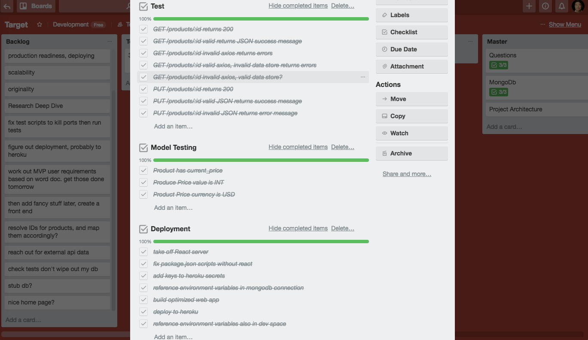

# Mun's myRetail

This is an end-to-end Proof-of-Concept RESTful Products Data Service API that aggregates product data from a local datastore and an external RedSky API, then returns it as JSON to the caller.

https://mun-myretail.herokuapp.com/

## Getting Started
```
git clone https://github.com/joshmun/myRetail.git
cd myRetail
npm install
```

### Connecting to the Database
Before you can run the app, this app requires a secret mongoURI to connect with the cloud-hosted database. Create an env.json file in the config folder and add in the mongoURI following this convention:
```
{
  "development": {
    "mongoURI": "your mongoURI login, password and link here"
  }
}

```

### Development
App runs on **localhost:5000**
```
npm run dev
```

### Testing
Kill all node processes, then:
```
npm test
```

## Routes
The API follows RESTful convention based on the products resource. The API returns aggregated product data given a product ID, and can accept a PUT request to update pricing information.

### GET Routes
Retrieves and aggregates Product Data from local storage and external RedSky API.

```
/products
/products/13860428
```

### PUT Routes
API was built assuming pure backend functionality. API receives product pricing updates via query strings.

At this time, API only updates pricing value. Currency functionality soon to be implemented.

```
/products/13860428?value=44
```

## Technologies & Methodologies
- MongoDb
  - hosted on mLab
- Express.js
- Node.js
- BDD/TDD
  - Mocha/Chai
- Git/GitHub
- Postman
- Heroku
- Agile/Kanban



## Notes
Heroku Logs:
```
heroku logs --tail
```
Deploy to Heroku:
```
git push heroku master
```
